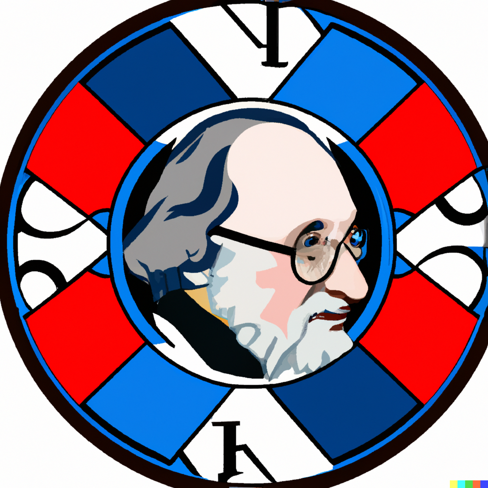

<div align="center">
  <h1>Alexandria</h1>
  
  <br />
  <a href="https://github.com/keep-starknet-strange/alexandria/issues/new?assignees=&labels=bug&template=01_BUG_REPORT.md&title=bug%3A+">Report a Bug</a>
  -
  <a href="https://github.com/keep-starknet-strange/alexandria/issues/new?assignees=&labels=enhancement&template=02_FEATURE_REQUEST.md&title=feat%3A+">Request a Feature</a>
  -
  <a href="https://github.com/keep-starknet-strange/alexandria/discussions">Ask a Question</a>
</div>

<div align="center">
<br />

[](https://github.com/keep-starknet-strange/alexandria/actions/workflows/test.yml)
[](LICENSE)
[](https://github.com/keep-starknet-strange/alexandria/issues?q=is%3Aissue+is%3Aopen+label%3A%22help+wanted%22)

</div>

<details>
<summary>Table of Contents</summary>

- [Report a Bug](#report-a-bug)
- [Request a Feature](#request-a-feature)
- [About](#about)
- [Features](#features)
- [Getting Started](#getting-started)
  - [Prerequisites](#prerequisites)
  - [Installation](#installation)
- [Usage](#usage)
  - [Build](#build)
  - [Run](#run)
  - [Test](#test)
  - [Format](#format)
- [Roadmap](#roadmap)
- [Support](#support)
- [Project assistance](#project-assistance)
- [Contributing](#contributing)
- [Authors \& contributors](#authors--contributors)
- [Security](#security)
- [License](#license)
- [Acknowledgements](#acknowledgements)
- [Contributors ✨](#contributors-)

</details>

---

## About

Alexandria is a community maintained standard library for Cairo 1.0.
It is a collection of useful algorithms and data structures implemented in Cairo.  
Current version: [v2.0.1](https://github.com/starkware-libs/cairo/releases/tag/v2.0.1)

## Features

This repository is divided in 8 modules:

- [Data Structures](./src/data_structures/README.md)
- [Encoding](./src/encoding/README.md)
- [Linalg](./src/linalg/README.md)
- [Math](./src/math/README.md)
- [Numeric](./src/numeric/README.md)
- [Searching](./src/searching/README.md)
- [Sorting](./src/sorting/README.md)
- [Storage](./src/storage/README.md)

## Getting Started

### Prerequisites

- [Cairo](https://github.com/starkware-libs/cairo)
- [Scarb](https://docs.swmansion.com/scarb)
- [Rust](https://www.rust-lang.org/tools/install)

### Installation

Alexandria is a collection of cairo utilities, which can be installed by adding the following line to your `Scarb.toml`:

```toml
[dependencies]
alexandria = { git = "https://github.com/keep-starknet-strange/alexandria.git" }
```

then add the following line in your `.cairo` file

```rust
use alexandria::math::sha512::sha512;
```

## Usage

### Build

```bash
scarb build
```

### Test

```bash
scarb test
```
Running a specific subset of tests 
```bash
scarb test -f math
```

### Format

```bash
scarb fmt
```

## Roadmap

See the [open issues](https://github.com/keep-starknet-strange/alexandria/issues) for a list of proposed features (and known issues).

- [Top Feature Requests](https://github.com/keep-starknet-strange/alexandria/issues?q=label%3Aenhancement+is%3Aopen+sort%3Areactions-%2B1-desc) (Add your votes using the 👍 reaction)
- [Top Bugs](https://github.com/keep-starknet-strange/alexandria/issues?q=is%3Aissue+is%3Aopen+label%3Abug+sort%3Areactions-%2B1-desc) (Add your votes using the 👍 reaction)
- [Newest Bugs](https://github.com/keep-starknet-strange/alexandria/issues?q=is%3Aopen+is%3Aissue+label%3Abug)

## Support

Reach out to the maintainer at one of the following places:

- [GitHub Discussions](https://github.com/keep-starknet-strange/alexandria/discussions)
- Contact options listed on [this GitHub profile](https://github.com/starknet-exploration)

## Project assistance

If you want to say **thank you** or/and support active development of Alexandria:

- Add a [GitHub Star](https://github.com/keep-starknet-strange/alexandria) to the project.
- Tweet about the Alexandria.
- Write interesting articles about the project on [Dev.to](https://dev.to/), [Medium](https://medium.com/) or your personal blog.

Together, we can make Alexandria **better**!

## Contributing

First off, thanks for taking the time to contribute! Contributions are what make the open-source community such an amazing place to learn, inspire, and create. Any contributions you make will benefit everybody else and are **greatly appreciated**.

Please read [our contribution guidelines](docs/CONTRIBUTING.md), and thank you for being involved!

## Authors & contributors

For a full list of all authors and contributors, see [the contributors page](https://github.com/keep-starknet-strange/alexandria/contributors).

## Security

Alexandria follows good practices of security, but 100% security cannot be assured.
Alexandria is provided **"as is"** without any **warranty**. Use at your own risk.

_For more information and to report security issues, please refer to our [security documentation](docs/SECURITY.md)._

## License

This project is licensed under the **MIT license**.

See [LICENSE](LICENSE) for more information.

## Acknowledgements

- [TheAlgorithms/Rust](https://github.com/TheAlgorithms/Rust) for inspiration regarding the implementation of algorithms.

## Contributors ✨

Thanks goes to these wonderful people ([emoji key](https://allcontributors.org/docs/en/emoji-key)):

<!-- ALL-CONTRIBUTORS-LIST:START - Do not remove or modify this section -->
<!-- prettier-ignore-start -->
<!-- markdownlint-disable -->
<table>
  <tbody>
    <tr>
      <td align="center" valign="top" width="14.28%"><a href="https://github.com/abdelhamidbakhta"><br /><sub><b>Abdel @ StarkWare </b></sub></a><br /><a href="https://github.com/keep-starknet-strange/alexandria/commits?author=abdelhamidbakhta" title="Code">💻</a></td>
      <td align="center" valign="top" width="14.28%"><a href="https://github.com/sdgalvan"><br /><sub><b>Santiago Galván (Dub)</b></sub></a><br /><a href="https://github.com/keep-starknet-strange/alexandria/commits?author=sdgalvan" title="Code">💻</a></td>
      <td align="center" valign="top" width="14.28%"><a href="https://github.com/dpinones"><br /><sub><b>Damián Piñones</b></sub></a><br /><a href="https://github.com/keep-starknet-strange/alexandria/commits?author=dpinones" title="Code">💻</a></td>
      <td align="center" valign="top" width="14.28%"><a href="https://github.com/greged93"><br /><sub><b>greged93</b></sub></a><br /><a href="https://github.com/keep-starknet-strange/alexandria/commits?author=greged93" title="Code">💻</a></td>
      <td align="center" valign="top" width="14.28%"><a href="https://github.com/mkaput"><br /><sub><b>Marek Kaput</b></sub></a><br /><a href="https://github.com/keep-starknet-strange/alexandria/commits?author=mkaput" title="Code">💻</a></td>
      <td align="center" valign="top" width="14.28%"><a href="https://github.com/amanusk"><br /><sub><b>amanusk</b></sub></a><br /><a href="https://github.com/keep-starknet-strange/alexandria/commits?author=amanusk" title="Code">💻</a></td>
      <td align="center" valign="top" width="14.28%"><a href="https://github.com/msaug"><br /><sub><b>Mathieu</b></sub></a><br /><a href="https://github.com/keep-starknet-strange/alexandria/commits?author=msaug" title="Code">💻</a></td>
    </tr>
    <tr>
      <td align="center" valign="top" width="14.28%"><a href="https://github.com/EvolveArt"><br /><sub><b>0xevolve</b></sub></a><br /><a href="https://github.com/keep-starknet-strange/alexandria/commits?author=EvolveArt" title="Code">💻</a></td>
      <td align="center" valign="top" width="14.28%"><a href="https://github.com/JordyRo1"><br /><sub><b>Jordy Romuald</b></sub></a><br /><a href="https://github.com/keep-starknet-strange/alexandria/commits?author=JordyRo1" title="Code">💻</a></td>
      <td align="center" valign="top" width="14.28%"><a href="https://github.com/gaetbout"><br /><sub><b>gaetbout</b></sub></a><br /><a href="https://github.com/keep-starknet-strange/alexandria/commits?author=gaetbout" title="Code">💻</a></td>
      <td align="center" valign="top" width="14.28%"><a href="https://github.com/LucasLvy"><br /><sub><b>Lucas @ StarkWare</b></sub></a><br /><a href="https://github.com/keep-starknet-strange/alexandria/commits?author=LucasLvy" title="Code">💻</a></td>
      <td align="center" valign="top" width="14.28%"><a href="https://milancermak.com/"><br /><sub><b>Milan Cermak</b></sub></a><br /><a href="https://github.com/keep-starknet-strange/alexandria/commits?author=milancermak" title="Code">💻</a></td>
      <td align="center" valign="top" width="14.28%"><a href="https://github.com/neotheprogramist"><br /><sub><b>Paweł</b></sub></a><br /><a href="https://github.com/keep-starknet-strange/alexandria/commits?author=neotheprogramist" title="Code">💻</a></td>
      <td align="center" valign="top" width="14.28%"><a href="https://github.com/tensojka"><br /><sub><b>Ondřej Sojka</b></sub></a><br /><a href="https://github.com/keep-starknet-strange/alexandria/commits?author=tensojka" title="Code">💻</a></td>
    </tr>
  </tbody>
  <tfoot>
    <tr>
      <td align="center" size="13px" colspan="7">
        
          <a href="https://all-contributors.js.org/docs/en/bot/usage">Add your contributions</a>
        </img>
      </td>
    </tr>
  </tfoot>
</table>

<!-- markdownlint-restore -->
<!-- prettier-ignore-end -->

<!-- ALL-CONTRIBUTORS-LIST:END -->

This project follows the [all-contributors](https://github.com/all-contributors/all-contributors) specification. Contributions of any kind welcome!

[scarb]: https://github.com/software-mansion/scarb
